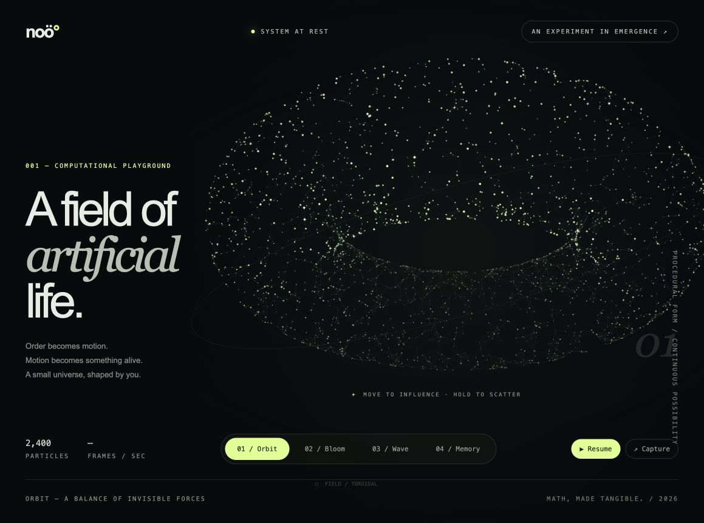

# NOÖ
### A field of artificial life.

An interactive particle sculpture built with vanilla JavaScript and Canvas 2D. No build step, dependencies, API keys, or paid services.

**[Launch the live experience](https://musicrun.github.io/noo/)**

## Explore
- **Orbit / Bloom / Wave** — morph between a torus, a rippling sphere, and a harmonic surface.
- **Move your pointer** to attract nearby particles. **Hold** to scatter them.
- **Memory** — draw a gesture and watch the particles form a moving three-dimensional filament around it.
- **Pause** the animation or **capture** the sculpture as a PNG.
- Reduced-motion preferences are respected. Controls support keyboard navigation.

## Run
Open `index.html` in a modern browser. Alternatively, run `python3 -m http.server 8000` from this folder and visit `http://localhost:8000`.

## Publish
Push this folder to a GitHub repository. In Settings → Pages, select deployment from the main branch and repository root. The experience is a static page.

## How it works
2,400 seeded particles interpolate between parametric surfaces. A perspective projection turns the three-dimensional coordinates into a two-dimensional canvas. Spatial buckets limit nearby connection searches, and depth sorting controls the rendering order. Pointer displacement adds a local attraction or repulsion field.

This is mathematical generative art, not a trained AI model or physical simulation. Created with AI-assisted development.

## License
MIT. See LICENSE.
